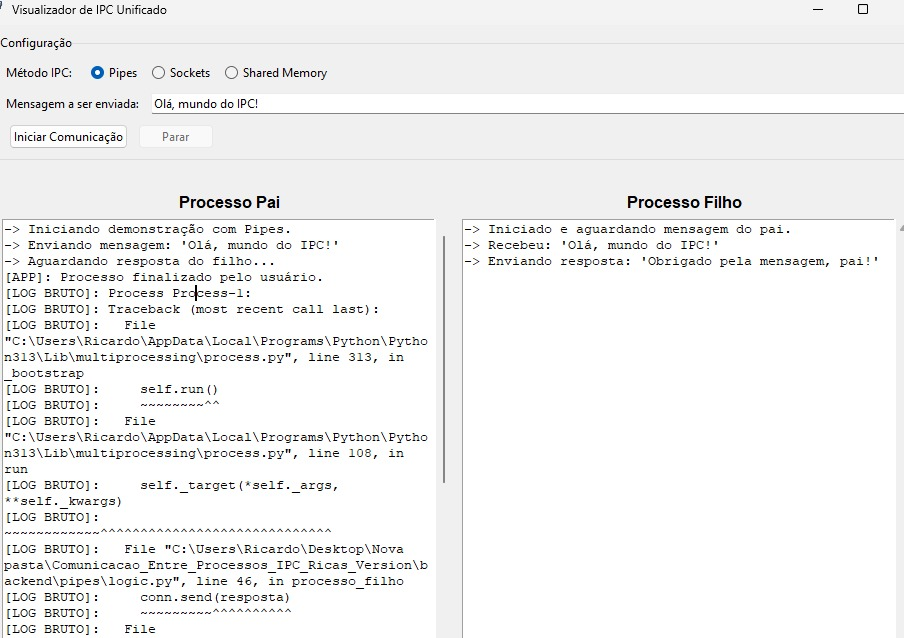
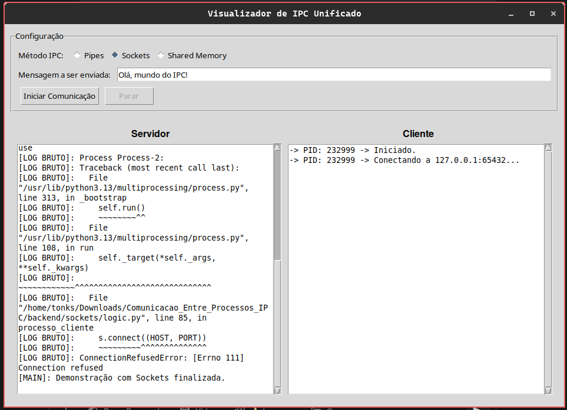
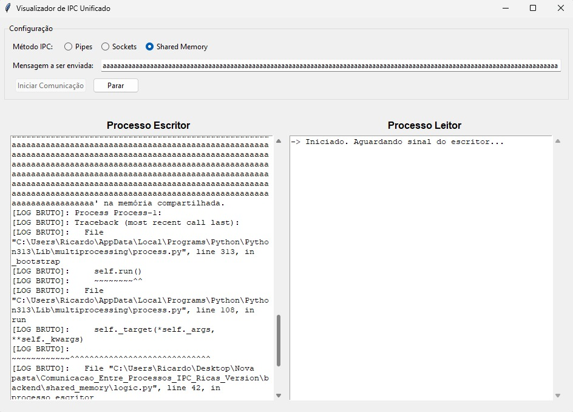
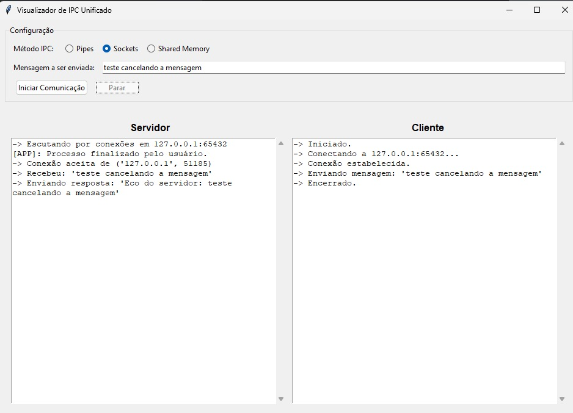
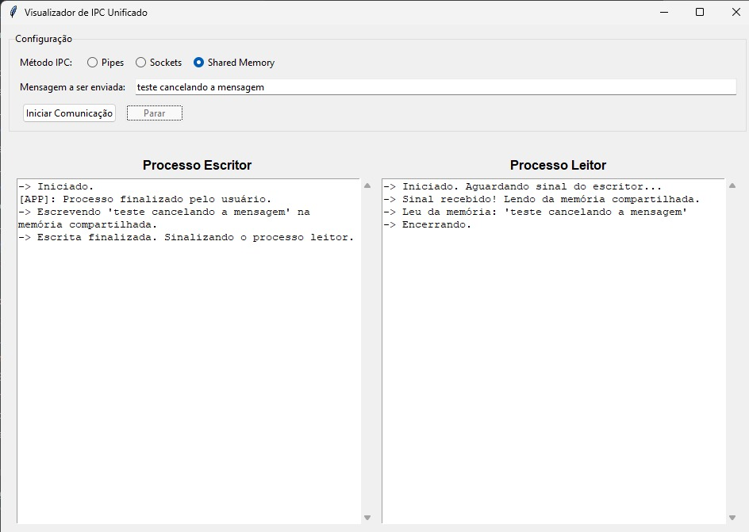

# 📝 Relatório de Execução de Testes - Ferramenta de Visualização de IPC

## 1. Informações Gerais

* **Data da Execução:** 07 e 08 de setembro de 2025
* **Executor do Teste:** Eduardo Rodrigues Araújo de Oliveira, Ricardo Hey
* **Ambiente de Teste:**
    * **Sistema Operacional:** Linux (distribuição baseada em Ubuntu/Debian)
    * **Versão do Python:** 3.13
    * **Hardware:** (Preencher com as especificações da máquina, se necessário)

## 2. Resumo dos Testes

O objetivo desta sessão de testes foi validar a funcionalidade principal de cada mecanismo de IPC, bem como a robustez da aplicação em cenários de interrupção, reexecução e entrada de dados extremos.

A funcionalidade principal ("caminho feliz") de todos os três módulos (**Pipes**, **Sockets** e **Memória Compartilhada**) foi validada com sucesso.

No entanto, foram identificados **quatro problemas críticos** que ocorrem em cenários específicos:
1.  **Falha no Encerramento Gracioso:** Ao interromper um processo manualmente através do botão "Parar", a interface exibe logs de erro brutos do sistema.
2.  **Falha de Reexecução (Sockets):** O módulo de Sockets não pode ser executado duas vezes seguidas, falhando na segunda tentativa.
3.  **Crash com Mensagem Longa (Shared Memory):** A aplicação quebra ao tentar enviar uma mensagem que excede o tamanho do buffer de memória compartilhada.
4.  **Encerramento Incompleto (Race Condition):** Ao parar um processo, logs do backend continuam a aparecer após a mensagem de finalização da GUI.

## 3. Casos de Teste Executados

| ID do Teste | Cenário de Teste | Passos para Reproduzir | Resultado Esperado | Resultado Obtido | Status |
| :--- | :--- | :--- | :--- | :--- | :--- |
| **TC-01** | Funcionalidade: Pipes | 1. Selecionar "Pipes".   2. Manter a mensagem padrão.   3. Clicar em "Iniciar". | Os logs de "Processo Pai" e "Processo Filho" mostram a troca de mensagens e a finalização correta. | Conforme esperado. | ✅ **Sucesso** |
| **TC-02** | Funcionalidade: Sockets | 1. Selecionar "Sockets".   2. Manter a mensagem padrão.   3. Clicar em "Iniciar". | Os logs de "Servidor" e "Cliente" mostram a conexão, a troca de mensagens e a finalização correta. | Conforme esperado. | ✅ **Sucesso** |
| **TC-03** | Funcionalidade: Shared Memory | 1. Selecionar "Shared Memory".   2. Manter a mensagem padrão.   3. Clicar em "Iniciar". | Os logs de "Processo Escritor" e "Processo Leitor" mostram a escrita, o sinal e a leitura correta dos dados. | Conforme esperado. | ✅ **Sucesso** |
| **TC-04** | Robustez: Interrupção Manual | 1. Iniciar a comunicação de qualquer um dos três módulos.   2. Durante a execução, clicar no botão "Parar". | O processo de backend é encerrado. A interface exibe uma mensagem limpa, como "Processo finalizado pelo usuário". | O processo é encerrado, porém a interface exibe um traceback de erro bruto (`[LOG BRUTO]`). | ❌ **Falha** |
| **TC-05** | Robustez: Reexecução de Sockets | 1. Executar o teste **TC-02** (Sockets) e esperar finalizar.   2. Imediatamente após, clicar em "Iniciar" novamente para rodar o Sockets pela segunda vez. | A comunicação via Sockets deve funcionar corretamente na segunda execução, assim como na primeira. | A segunda execução falha. O servidor não consegue iniciar devido a um erro `OSError: [Errno 98] Address already in use`. | ❌ **Falha** |
| **TC-06** | Robustez: Mensagem Excede Buffer (Shared Memory) | 1. Selecionar "Shared Memory".   2. Inserir mensagem > 1024 caracteres.   3. Clicar em "Iniciar". | A aplicação deve exibir uma mensagem de erro informativa e não travar. | A aplicação quebra e exibe um traceback de erro bruto (`[LOG BRUTO]`). | ❌ **Falha** |
| **TC-07** | Robustez: Interrupção Incompleta (Sockets) | 1. Selecionar "Sockets" e clicar em "Iniciar".   2. Clicar imediatamente em "Parar". | O processo backend para. Nenhum log do backend deve aparecer após a mensagem "[APP]: Processo finalizado pelo usuário". | Logs do backend continuam a aparecer na interface *depois* da mensagem de finalização da GUI. | ❌ **Falha** |
| **TC-08** | Robustez: Interrupção Incompleta (Shared Memory) | 1. Selecionar "Shared Memory" e clicar em "Iniciar".   2. Clicar imediatamente em "Parar". | O processo backend para. Nenhum log do backend deve aparecer após a mensagem "[APP]: Processo finalizado pelo usuário". | Logs do backend continuam a aparecer na interface *depois* da mensagem de finalização da GUI. | ❌ **Falha** |

## 4. Análise Detalhada dos Problemas Encontrados

### P-01: Exibição de Erros Brutos na Interrupção Manual (TC-04)

Ao forçar o encerramento de um processo com o botão "Parar", a chamada `terminate()` causa uma interrupção abrupta no script de backend. Isso gera erros de sistema (como `BrokenPipeError`) que são capturados pela thread de leitura do `stderr`. Como esses erros não estão no formato JSON esperado, eles são exibidos como "[LOG BRUTO]", poluindo a interface e confundindo o usuário.

**Evidência:**

### P-02: Falha na Reexecução do Módulo Sockets (TC-05)

Após a primeira execução do módulo Sockets, o sistema operacional mantém a porta `65432` em um estado temporário de `TIME_WAIT`. Ao tentar executar o módulo novamente, o novo processo servidor tenta se vincular (`bind`) a essa porta, mas o sistema operacional nega o pedido, pois considera que ela ainda está em uso. Isso causa o erro `OSError: [Errno 98] Address already in use`.

**Evidência:**

### P-03: Crash com Mensagem Longa em Memória Compartilhada (TC-06)

O script `logic.py` do shared_memory cria um buffer de memória compartilhada de tamanho fixo (1024 bytes). Ao receber uma mensagem maior que este limite, o código tenta escrever além da capacidade do buffer, o que levanta uma exceção não tratada (`IndexError`) no processo backend. A GUI captura a saída de erro desta exceção e a exibe como um `[LOG BRUTO]`.

**Evidência:**

### P-04: Logs do Backend Aparecem Após o Cancelamento (TC-07, TC-08)

Este problema é uma **condição de corrida**. A função `stop_process` na GUI envia o sinal `terminate()` e imediatamente exibe a mensagem de finalização. No entanto, o processo backend não para instantaneamente. Nesse intervalo, ele pode executar mais algumas linhas de código e enviar logs, que chegam à GUI *após* ela já ter declarado o processo como finalizado.

**Evidência:**

## 5. Recomendações e Próximos Passos

Para corrigir os problemas encontrados e aumentar a robustez da aplicação, as seguintes ações são recomendadas:

1.  **Para o problema P-01:** Implementar uma "flag" (bandeira) de controle na GUI. Quando o usuário clicar em "Parar", a flag é ativada. O código que exibe os logs brutos deve então verificar essa flag e, se ela estiver ativa, ignorar os erros de sistema esperados durante o encerramento manual.
Status: ✅ Corrijido

2.  **Para o problema P-02:** Adicionar a opção de socket `SO_REUSEADDR` no script `backend/sockets/logic.py`. Esta opção deve ser configurada no socket do servidor antes da chamada `bind()`, instruindo o sistema operacional a permitir a reutilização imediata do endereço e da porta.
Status: Não Corrijdo
 
3.  **Para o problema P-03:** Implementar uma verificação de tamanho no backend `logic_sm.py`. Antes de escrever na memória, o script deve comparar o tamanho da mensagem com o tamanho do buffer. Se exceder, deve logar um erro informativo e encerrar graciosamente, evitando o crash.
Status: Nao Corrijido

 4.  **Para o problema P-04:** Modificar a função `stop_process` na GUI (`main_gui.py`). Após chamar `self.process.terminate()`, adicionar uma chamada a `self.process.wait(timeout=1.0)` para garantir que o processo tenha tempo de encerrar completamente antes da GUI continuar sua execução e reabilitar os botões.
Status: Não Corrijido
